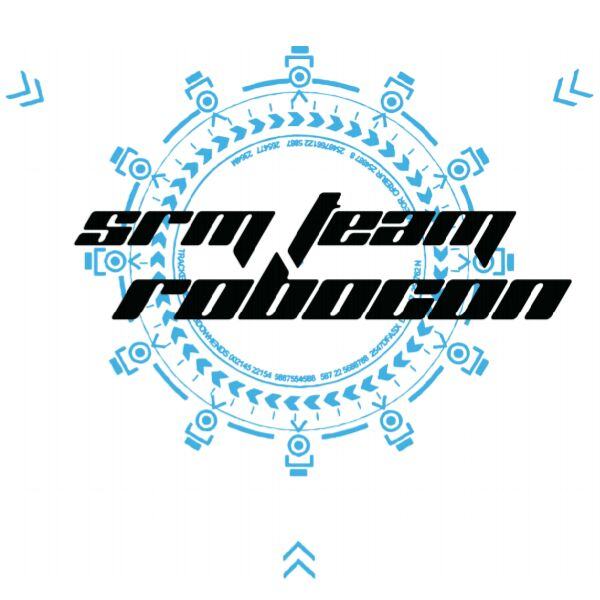

 
 
<strong><i>SRM TEAM ROBOCON WEBSITE</i></strong>
 
 

 

 
 

 

## SRM ROBOCON WEBSITE DETAILS. 📍

---
## Live Demo. 📝
- https://abhaysv.github.io/Robocon-Website/. 

---

## Demo Images 📝

---

